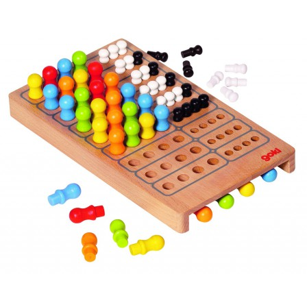

# Mastermind Algorithm in Python

This project aims to implement and test and algorithm to solve the old game *Mastermind*. 



This implementation is generic: it supports any number of symbols, positions or with/without doublons as long as this produces some valide codes. The official configuration is 6 symbols, 4 positions, supports doublons. It is the default configuration of the python scripts provided here.


Three main scripts are provided:

- **play.py** - allow to play the game. the player can hask for help of the algorithm.
- **algo_once.py** - test the algorithm on a single code to break.
- **algo_all.py** - test the algorithm on all codes to measure it's performances.

## play.py

This is the funiest script of course since you can actualy play the game. You can hask help from the algorithm if needed.

``` shell
usage: play.py [-h] [-s SYMBOLS] [-l CODE_LENGTH] [--no_doublon] [-n NB_GAMES]

optional arguments:
  -h,               --help
  -s SYMBOLS,       --symbols SYMBOLS
  -l CODE_LENGTH,   --code_length CODE_LENGTH
  --no_doublon
  -n NB_GAMES,      --nb_games NB_GAMES
```

```
##################################################
New Game (1) !
Write your guess as a string of 4 symbols in 123456 with no spaces
> Ctrl+C or "exit" to show solution and exit
> "help" for the computer to play something for you
> "grid" to show an helping table
Step  1, guess: 1123, 0 well placed,   2 ill-placed, 222 remaining hypothesis
Step  2, guess: 2432, 0 well placed,   3 ill-placed, 5 remaining hypothesis
Step  3, guess: 3245, 3 well placed,   0 ill-placed, 2 remaining hypothesis
Step  4, guess: 3244, 4 well placed,   0 ill-placed, 1 remaining hypothesis
You won in 4 steps
##################################################
```

The number of remaining hypothesis is an information provided by the algorithm. It tells you how much information you are supposed to have acquired with the guesses already played. The least remaining hypothesis, the better.


The command **grid** displais a summary of the remaining hypothesis managed by the algorithm. For each position, it tells how probable each symbol is to be present. It can help understanting information provided by the plaid guesses.


## algo_once.py

This script allow to test the algorithm on a single game. You can provide the code to break with the `-c` option. 

``` shell
usage: algo_once.py [-h] [-s SYMBOLS] [-l CODE_LENGTH] [--no_doublon] [-c CODE]

optional arguments:
  -h,               --help
  -s SYMBOLS,       --symbols SYMBOLS
  -l CODE_LENGTH,   --code_length CODE_LENGTH
  --no_doublon
  -c CODE,          --code CODE
```

```
Prepared in 0:00:00.001242
step:  1, guess:1123 hash:01, remaining: 276/1296
step:  2, guess:2445 hash:02, remaining:  42/1296
step:  3, guess:6562 hash:01, remaining:   5/1296
step:  4, guess:3354 hash:22, remaining:   1/1296
step:  5, guess:5334 hash:40, remaining:   1/1296
```

## algo_all.py

This script allow to evaluate the algorithm. It plais all games (a game with each code as the solution). Interesting evaluation metrics are the average game length and the maximum game length.

```shell
usage: algo_all.py [-h] [-s SYMBOLS] [-l CODE_LENGTH] [--no_doublon] [-f FIRST_GUESS]

optional arguments:
  -h, --help
  -s SYMBOLS,     --symbols SYMBOLS
  -l CODE_LENGTH, --code_length CODE_LENGTH
  --no_doublon
  -f FIRST_GUESS, --first_guess FIRST_GUESS
```

```
100%|████████| 1296/1296 [00:07<00:00, 174.45it/s]
First Guess: 1123 (<Code @8 '0012'>)
Mean: 4.40
Max:  6
1:   0% (1)
2:   1% (13)
3:   8% (112)
4:  41% (540)
5:  45% (596)
6:   2% (34)
['1126', '1163', '1623', '1632', '1642', '1652', '1661', '2613', '2631', '2632', '3156', '3555', '3621', '4423', '4433', '5111', '5436', '5463', '5523', '5615', '5653', '6122', '6123', '6126', '6132', '6253', '6324', '6354', '6432', '6462', '6463', '6535', '6651', '6653']
```

The final list are the codes the algorithm did not break in 5 guesses or less.
In theory such an algorithm should not use more than 5 guesses in the standard configuration. Thus, they can be used with the **algo_once.py** script to investigate.
